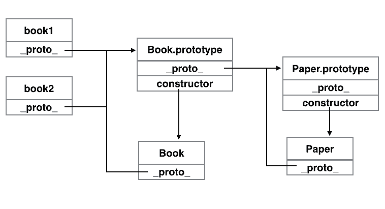

#Answers For Interview Questions

所有题目来自于 [Front-end Job Interview Question](https://github.com/darcyclarke/Front-end-Developer-Interview-Questions#html)  
答案主要来自于网络收集，部分为个人的理解。 编写该文档主要目的是为了更好地收集和学习前端知识。

##HTML

+ ####What is `doctype` do?  
	`doctype`描述了该页面的HTML类型。同时浏览器通过`doctype`来决定如何渲染页面，如果不含`doctype`或是`doctype`错误会导致浏览器触发怪癖模式。目前`<!DOCTYPE html>`是个好选择（大部分浏览器支持，包括IE6）。详细见[What's up, Doctype?](http://stackoverflow.com/questions/414891/whats-up-doctype)

+ ####Difference between standards mode and quirks mode?  
	在怪癖模式时，浏览器会根据不标准的行为渲染（处理）页面，并且不同浏览器的怪癖模式不同（尤其是IE和其他浏览器）；相反在标准模式时，所有浏览器会根据统一的标准（理想上）。  
	对于HTML文件浏览器通过`doctype`来决定选择哪种模式；对于XHTML（`'application/xhtml+xml'`）则无需`doctype`浏览器也会选择标准模式，但IE8及更低版本无法识别该种类型的文件而触发下载，如果XHTML使用`text/html`MIME type，则浏览器会将其看作HTML，所以选择标准模式需要`doctype`。详细可以看[Quirks Mode and Standards Mode](https://developer.mozilla.org/en-US/docs/Quirks_Mode_and_Standards_Mode)

+ ####limitations when serving XHTML pages  
	IE8及更低版本无法识别`application/xhtml+xml`类型

+ ####serve a page with content in multiple language  
???

###JavaScript

+ ####Explain event delegation  
	事件代理就是利用事件冒泡的特性指定一个事件处理程序统一管理同一类型的事件。实际操作就是将事件处理程序绑定在事件触发元素的父级元素（或是父级的父级，依此类推）并根据事件对象判断触发元素来进行相应操作。  
	这样做的好处有：无需给每个元素绑定事件处理程序，减少浏览器内存消耗；较少的事件绑定程序使页面加载更快；动态添加的元素是无需绑定事件处理程序；移除元素时无需要考虑移除事件处理程序[Event delegation in JavaScript](http://www.nczonline.net/blog/2009/06/30/event-delegation-in-javascript/)

+ ####Explain `this` in JavaScript  
	函数中的`this`的值取决于函数调用的模式：  
  1. 方法调用模式  
  当函数被保存为对象的一个属性时，成该函数为该对象的方法。函数中`this`的值为该对象。
  
  		var foo = {
  			name: 'fooname',
  			getName: function (){
  				return this.name  
  			}
  		}
  		
  		foo.getName();  // this => foo
  2. 函数调用模式  
  当函数并不是对象的属性。函数中`this`的值为全局对象  
  note：某个方法中的内部函数中的`this`的值也是全局对象，而非外部函数的`this`
  
  		function foo(){
  			this.name = 'fooname';  
  		}
  		foo();  // this => window
  3. 构造器调用模式  
  即使用`new`调用的函数，则其中`this`将会被绑定到那个新构造的对象。
  
  		function Foo(){
  			this.name = 'fooname';
  		}
  		var foo = new Foo();  // this => foo
  4. 使用`apply`或`call`调用模式  
  该模式调用时，函数中`this`被绑定到apply或call方法调用时接受的第一个参数。
  
  		function getName(name){
  			this.name = name;
  		}
  		var foo = {};
  		getName.call(foo, name);  // this =>foo
  
+ ####Explain prototypal inheritance  
	所有的object都是基于prototype的，同时prototype也是object，定义了基于它的object的属性和方法。在大部分浏览器中object的_proto_属性对应这其prototype。
	例如一些内建的Array, Function, 他们实例的prototype均为Object
所以object会拥有两类属性和方法：实例类和原型类
note: hasOwnProperty方法可以判断某属性或方法属于哪一类。
举个例子：  

		var Paper = function(){};
		var Book;
		Book.prototype = new Paper();
		var book1 = new Book();
		var book2 = new Book();
		
  图释：  
  
  
+ ####How do you go about testing your JavaScript?  
???

+ ####AMD vs. CommonJS?  
???

+ ####Explain why the following doesn't work as an IIFE: `function foo(){ }();`?  
	因为浏览器将其当作了function declaration，等价于  

		function foo(){};
		();  //SyntaxError: Unexpected token )
	修补方法就是让浏览器清楚这是function expression  

		// 添加()，以下两种都可行
		(function (){ /* stuff */ })();
		(function (){ /* stuff */ }());
		
		// 如果不需要返回值，可以在function前加一元运算符
		!function(){ /* stuff */ }();
		~function(){ /* stuff */ }();
		
		// 或是前面加new
		new function(){ /* stuff */ };
		new function(){ /* stuff */ }();  //需要传递参数时才需要括号

+ ####What's the difference between a variable that is:`null`, `undefined`, `undeclared`?  
	`null`和`undefined`都表示空，后者更为有用。  
	以下情况会返回`undefined`值  
	+ 未修改的全局变量`undefined`
	+ 没有定义`return`或是`return`没有显示返回任何内容的函数
	+ 访问不存在的属性
	+ 函数参数没有传递值
	+ 被设置为	`undefined`值的变量  
	
	`null`可以看作一个表示空的object。
	`undeclared`可以看作没有被`var`定义且没有赋值的变量，属于语法错误（浏览器会报错）
	
		typeof undefined //  'undefined'
		typeof null      // 'object'
		
+ ####What is a closure, and how/why would you use one?  
	闭包可以理解为内部函数调用外部函数变量的一种运用。
	在JavaScript中，function是一个object，也就是Function的实例。所以function含有多个属性，包括外部可接触属性和内部属性。
	
	其中[[ Scope ]]就是内部属性，当函数建立后它就包含一个由object的组成的集合，该集合成为scope chain，其定义该函数可以获得的数据
scope chain中的每个object称为variable object

	当函数执行时，函数会创建另一个名为execution context的属性。该属性定义函数的执行环境，所以所次执行函数会导致多个execution context属性，该属性在函数执行结束后销毁。
	
	每个execution context属性包含一个自己的scope chain。当该属性创建时，scope chain会根据[[ Scope ]]属性进行有顺序的初始化(copy)，初始化结束后，一个新的名为activation object的object被创建，并插入到scope chain的最开头。该object包含local variable, named argument, this, arguments。
	
	函数执行时查询变量会沿着execution context的scope chain从头开始查询。
	
	当存在closure时，外部函数执行时所创建的execution context中的scope chain会被复制进内部函数的[[ Scope ]]属性中。也就是说当外部函数执行完毕后，execution context被销毁，但内部函数的[[ Scope ]]仍保留了被销毁的execution context的scope chain(包含activation object)
	
	利用闭包可以给对象设置私有属性并利用特权(Privileged)方法访问私有属性。
	
		var Foo = function(){
			var name = 'fooname';
			var age = 12;
			this.getName = function(){
				return name;
			};
			this.getAge = function(){
				return age;
			};
		};
		var foo = new Foo();
		
		foo.name;        //  => undefined
		foo.age;         //  => undefined
		foo.getName();   //  => 'fooname'
		foo.getAge();    //  => 12

	
+ ####What's a typical use case for anonymous functions?  
	匿名函数可以用于闭包。例如：
	
		var foo = function (){
			// stuff
			return function(){
			// stuff
			};
		}
	
			
+ ####What is `'use strict';`?   
`'use strict';`用于开启JavaScript的严格模式。

		(function(){
			'use strict';
			
			// strict mode
			
			function foo() {
				// strict mode
			}
			
		})();
严格模式主要变化有:
	+ 去掉`with`  
	如果使用会被认为无效的语法错误。
	+ 禁止使用未申明的变量  
	在普通模式中使用未申明的变量会创造一个全局变量，在严格模式中，该行为会报错。
	+ `this`不再指向`global`  
	在普通模式中函数作为普通函数调用时，其中的`this`指向`global`。在严格模式中，`this`的值为undefined。
	+ 禁止重复  
	在严格模式中，函数参数名重复、对象属性名重复都会报告语法错误。
	+ 显示报错  
	设置禁止修改后，仍对对象属性进行修改，在普通模式中，该行为会失败，但不会报错；在严格模式中该行为会报错。

	总的说，严格模式对一些不安全行为做出了限制并会报错，并去掉了部分令人混乱的特性。详细见[It’s time to start using JavaScript strict mode](http://www.nczonline.net/blog/2012/03/13/its-time-to-start-using-javascript-strict-mode/)

+ ####Difference between: `function Person(){}`, `var person = Person()`, and `var person = new Person()`?  
	`function Person(){}`是声明函数，只要是在同一作用域内，可以在任意地方调用该函数，即使在声明函数前。  
	`var person = Person()`是调用名为Person的函数，并将返回值赋值给person，如果该函数没有返回值，则将undefined赋值给person。  
	`var person = new Person()`一般所调用的是构造函数，返回一个新对象，并且构造函数中的`this`指向这个新对象。
	
+ ####What's the difference between `.call` and `.apply`?  
	两个都是调用函数的方法，两者不同点是参数的不同。  
	两个方法第一个参数相同，都是函数调用的上下文，即`this`的指向。  
	`.call`方法将第一个之后的参数作为函数的调用传入的值（参数）。`.apply`方法传入函数调用的参数则是放在其第二个参数的数组中。  
	note：`.apply`的第二个参数既可以是数组，也可以是类数组，如arguments
	
		function sum(){
			var result = 0;
			for(var i = 0, l = arguments.length; i < l; i++){
				result += arguments[i];
			}
			return result;
		}
		
		sum.call(null, 1, 2, 3);     // =>6
		sum.apply(null, [1, 2, 3]);  // =>6
		